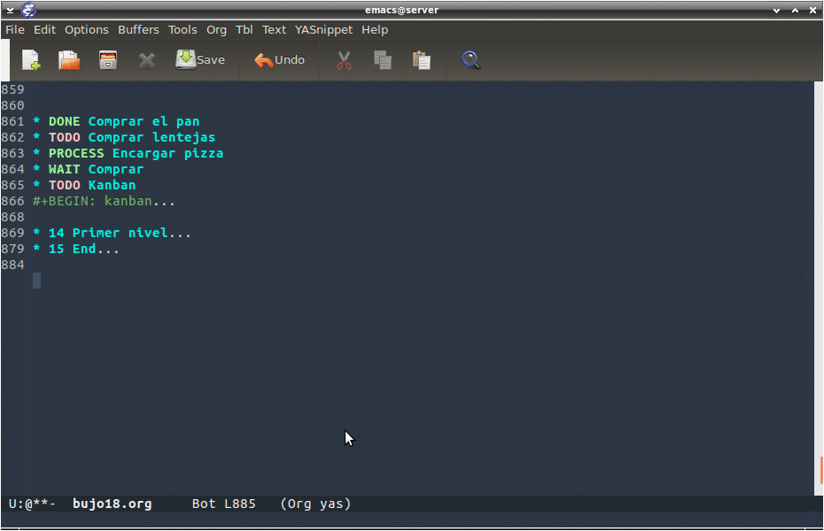

Perseguimos esta situación:

[Vídeo](https://asciinema.org/a/4gijw6gs9jlcf5dxnlj0f12bh)

Primero vemos si está en el repositorio con el comando `M-x: package-list-packages`

Comprobamos que no está, por tanto, deberemos instalarlo de forma manual.

Para ello instalaremos de manera manual el paquete `org-kanban` desde el repositorio del desarrollador siguiendo estos pasos.

El repositorio del [desarrollador](https://github.com/gizmomogwai/org-kanban)

Bajaremos el archivo: `org-kanban.el` así:

```bash
wget https://raw.githubusercontent.com/gizmomogwai/org-kanban/master/org-kanban.el
```

Ahora tendremos el archivo `org-kanban.el` que instalaremos de manera manual.

Para ello invocamos el comando para instalar de forma manual: `M-x: load-file` pulsaremos **intro** (`RET`), a continuación escribimos el camino donde encontrará el archivo que hemos bajado.

Se instala rápidamente.

Dentro del mismo archivo `org-kanban.el` vemos que tiene algunas dependencias:

```
(require 'org)
(require 'dash)
(require 'subr-x)
```

Las instalamos mediante este procedimiento: `M-x: package-list-packages`, lo que nos dará una lista de paquetes para instalar.

Instalamos las dependencias, al menos hemos instalado `dash`, es una libreria avanzada para trabajar con tablas.

A continuación creamos una lista de `TODO`, así:

```orgmode
* TODO Comprar el pan
* TODO Comprar lentejas
* PROCESS Encargar pizza
* WAIT Comprar detergente

#+BEGIN: kanban
#+END:
```

Bien pues ya tenemos todo preparado para generarla.

A continuación nos situamos en esta línea `#+BEGIN: kanban` y pulsamos `C-c C-c`

Esto nos generará el siguiente código:

```orgmode
 #+BEGIN: kanban
  | TODO                 | PROCESS            | WAIT                   | HABIT | DONE | CANCEL |
  |----------------------+--------------------+------------------------+-------+------+--------|
  | [[Comprar el pan]]   |                    |                        |       |      |        |
  | [[Comprar lentejas]] |                    |                        |       |      |        |
  |                      | [[Encargar pizza]] |                        |       |      |        |
  |                      |                    | [[Comprar detergente]] |       |      |        |
 #+END:
```
Debemos tener en cuenta que las cabeceras dependerán de la explicitación de las mismas que tengamos en la parte superior del documento, en este caso estaban definidas al princio del documento así:

```orgmode
#+TODO: TODO(t) | PROCESS(p) | WAIT(w) | HABIT(h) | DONE(d) | CANCEL(c)
```

Para mover las tareas de una columna a otra deberemos activar el modo `M-x: org-kanban/shift`.

Nos fijaremos en la parte de abajo de la ventana, pues tendremos las teclas para mover a la izquierda `j` y a la derecha `k`.

Al cambiar a la fila de abajo deberemos activar de nuevo el modo para mover las columnas `M-x: org-kanban/shift`.



Otra referencia muy intresante la podemos encontrar en el blog de [uGeek](https://ugeek.github.io/Kanban-para-Org-Mode/) donde se explican algunos aspectos con mayor amplitud.
