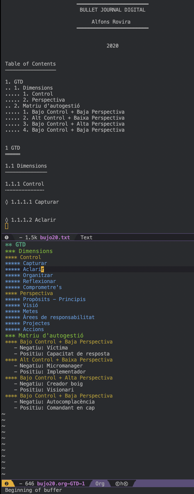

Leyendo el blog de [uGeek](https://ugeek.github.io/blog/post/2020-09-03-visualizar-aparte-una-cabecera-de-un-orgmode-en-emacs.html) he aprendido a aislar un apartado en un buffer, una ventana, y a imprimirlo posteriormente.

Imaginemos que hemos desarrollado un documento largo:

```txt
* Index
* GTD
* Dssing Thingking
```

Desplegado obtendríamos algo así:

```txt
* Index
* GTD
** Dimensions
*** Control
**** Capturar
**** Aclarir
**** Organitzar
**** Reflexionar
**** Comprometre's
*** Perspectiva
**** Propòsits - Principis
**** Visió
**** Metes
**** Àrees de responsabilitat
**** Projectes
**** Accions
** Matriu d'autogestió
*** Bajo Control + Baja Perspectiva
   - Negatiu: Víctima
   - Positiu: Capacitat de resposta
*** Alt Control + Baixa Perspectiva
   - Negatiu: Micromanager
   - Positiu: Implementador
*** Bajo Control + Alta Perspectiva
   - Negatiu: Creador boig
   - Positiu: Visionari
*** Bajo Control + Baja Perspectiva
   - Negatiu: Autocomplacència
   - Positiu: Comandant en cap
* Dessign Thinking
   1. Empatitza
   2. Defineix
   3. Idea
   4. Prototipa
   5. Testeja
```

Si nos situáramos en el apartado `* GTD` y ejecutáramos los comandos `Ctrl-c Ctrl-x b` obtendríamos un nuevo buffer, una ventana con el contenido únicament del apartado `* GTD`.

Ahora que ya tenemos el contenido aislado queremos exportarlo a diferentes formatos, procedemos a exportarlo a:

- Texto Plan txt: `Ctrl-c Ctrl-e t u`. Ontendremos un nuevo archivo con el mismo nombre que el archivo original, aunque con la extensión `.txt`.
- PDF: `Ctrl-c Ctrl-e l p`.
- Markdown: `Crtl-c Ctrl-e M m`.



En la parte de abajo se puede ver el buffer con la información aislada, generada a partir del primer documento mucho más largo.

En la parte de arriba se puede ver el archivo `txt` generado.

